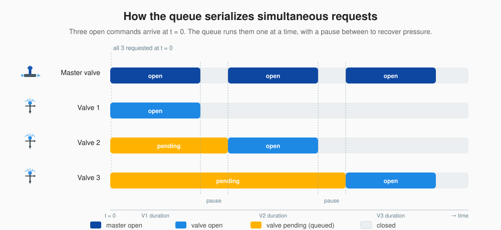

# ESPHome Sprinkler Queue


[](LICENSE)
[](https://esphome.io/)
[](https://github.com/cristoforocervino/esp32-sprinkler-queue/actions/workflows/validate-examples.yaml)
[](https://github.com/cristoforocervino/esp32-sprinkler-queue/commits/main)

A queue-based sprinkler controller for [ESPHome](https://esphome.io/) with native [Home Assistant](https://www.home-assistant.io/) valve entities.

**Hard guarantee: at most one zone valve is open at any time, ever.** Concurrent open requests queue up and are served one after another with a configurable inter-valve pause to let water pressure recover.

---

## Why this exists

ESPHome ships an official [`sprinkler:`](https://esphome.io/components/sprinkler/) component with its own queue and overlap policies — but that logic only kicks in when you drive watering through its actions (`sprinkler.start_full_cycle` and friends). If you instead trigger the individual valves directly — say, two automations both opening a valve at the same instant — the queue is bypassed and both valves open together, halving water pressure and on weak supply lines dropping it low enough to trip pumps or starve other appliances.

This component takes a different approach: **serialization is a hard, built-in invariant**. No matter how the commands arrive, at most one zone valve is open at any time, ever. Excess requests queue. Each valve runs for its configured duration, then closes; an inter-valve pause lets pressure recover; the next queued valve opens. Cancellations (closing a queued or active valve from HA) are honoured immediately and the queue keeps moving.

What I deliberately don't do: scheduling, repeats, multipliers, pump logic, partial position. Those belong in HA automations, where you have a richer language than YAML for them. The firmware's job is one thing only — guarantee non-overlap and protect water pressure.



---

## Features

- **Queue-based serialization** — only one zone valve open at a time, no exceptions
- **PENDING state** — queued valves report `current_operation = OPENING` so HA shows "Opening…" with the transition animation
- **Per-valve max duration** — configurable via a HA `number.*` entity, persisted across reboots
- **Inter-valve pause** — global pause between valves (also a `number.*`, persisted)
- **Optional master valve** — auto-opened whenever any zone is active; omit the block if your setup doesn't need one
- **Optional manual master override** — opt-in HA switch to open the master valve independently of any zone, for debugging, pressure testing, or pipe flushing

---

## Installation

In your ESPHome device YAML:

```yaml
external_components:
  - source: github://cristoforocervino/esp32-sprinkler-queue
    components: [sprinkler_queue]
```

---

## Quick start

A minimal 3-zone setup with direct ESP32 GPIO pins, no master valve:

```yaml
esphome:
  name: garden-sprinkler

esp32:
  board: esp32dev

wifi:
  ssid: !secret wifi_ssid
  password: !secret wifi_password

api:
external_components:
  - source: github://cristoforocervino/esp32-sprinkler-queue
    components: [sprinkler_queue]

sprinkler_queue:
  pause_between_valves:
    initial_value: 5
  valves:
    - name: "Front lawn"
      pin: GPIO16
      initial_duration: 600
    - name: "Back lawn"
      pin: GPIO17
      initial_duration: 600
    - name: "Roses"
      pin: GPIO18
      initial_duration: 300
```

Flash, add the device to Home Assistant via the ESPHome integration, and you'll have:

- 3 × `valve.*` entities, each with state-based icons
- 3 × `number.*_duration` entities (slider/box, 1–3600 s, persisted)
- 1 × `number.pause_between_valves` (0–120 s, persisted)

---

## Configuration reference

### Top-level options

| Option | Type | Default | Description |
|---|---|---|---|
| `id` | ID | auto | Component ID, useful for `service:` calls |
| `pause_between_valves` | block (required) | — | Configures the inter-valve pause `number.*` entity (see below) |
| `master_valve` | block (optional) | omitted | Configures the master valve relay + `binary_sensor.*` (see below) |
| `valves` | list (required, ≥1) | — | List of zone valves (see below) |

### `pause_between_valves` block

Standard ESPHome [number](https://esphome.io/components/number/) schema, plus:

| Option | Type | Default | Description |
|---|---|---|---|
| `name` | string | `Pause between valves` | HA display name |
| `icon` | mdi icon | `mdi:timer-pause-outline` | HA icon |
| `initial_value` | int (s) | `5` | Initial pause if no value persisted yet |
| `min_value` | int (s) | `0` | Minimum allowed value |
| `max_value` | int (s) | `120` | Maximum allowed value |
| `restore_value` | bool | `true` | Persist value across reboots |
| `mode` | enum | `auto` | `box` for a numeric input field, `slider` for a slider |

### `master_valve` block (optional)

Omit the entire block if your setup doesn't have a master valve.

| Option | Type | Default | Description |
|---|---|---|---|
| `name` | string | `Master valve` | HA display name |
| `icon` | mdi icon | `mdi:water-pump` | HA icon for the binary_sensor |
| `pin` | pin schema | required | Output pin controlling the master relay |
| `manual_switch` | block (optional) | omitted | Adds an HA switch to open the master manually (see below) |

When configured, the master pin is opened together with any zone and closed when no zone is active.

#### `manual_switch` sub-block (optional)

Opt-in HA switch entity that lets you open the master valve **independently** of any zone — useful for debugging plumbing, pressure-testing pipes, flushing, or commissioning a new installation. Omit the block to get the standard behavior (master pin follows zones only).

```yaml
master_valve:
  pin: GPIO16
  manual_switch:                       # presence of the block enables it
    name: "Master valve manual"        # optional
    icon: "mdi:wrench"                 # optional
```

Generates one extra entity: `switch.<device>_master_valve_manual`.

**Behavior** (OR-logic with the queue):

| Manual switch | Any zone open | Master pin |
|---|---|---|
| OFF | no | OFF |
| OFF | yes | ON (normal irrigation) |
| ON | no | **ON (debug mode)** |
| ON | yes | ON |

When you flip the switch OFF while a zone is still active, the master stays ON until the zone closes — the queue keeps full control as soon as the manual override releases it.

**Safety**: the switch always boots **OFF** after a power cycle (no `restore_value`). A reboot will never leave the master open unattended.

| Option | Type | Default | Description |
|---|---|---|---|
| `name` | string | `Master valve manual` | HA display name |
| `icon` | mdi icon | `mdi:wrench` | HA icon |

### Per-valve entries (`valves[*]`)

| Option | Type | Default | Description |
|---|---|---|---|
| `name` | string | required | HA display name (this also becomes the entity_id slug) |
| `pin` | pin schema | required | Output pin controlling this zone's relay |
| `initial_duration` | int (s) | `300` | Initial max duration if no value persisted yet (1–3600) |

Each valve generates two HA entities: `valve.<device>_<name>` and `number.<device>_<name>_duration`.

### Pin schema

The `pin:` field accepts any [ESPHome output pin schema](https://esphome.io/guides/configuration-types/#pin-schema). A few common shapes:

```yaml
# Direct GPIO, default (active-high):
pin: GPIO16

# Direct GPIO with inversion (active-low relay module):
pin: { number: GPIO17, inverted: true }

# 74HC595 shift register output:
pin: { sn74hc595: relay_chain, number: 1, inverted: false }

# MCP23017 I²C expander output:
pin: { mcp23xxx: io_exp, number: 0, mode: OUTPUT, inverted: true }

# PCF8574 I²C expander output:
pin: { pcf8574: io_exp, number: 0, mode: OUTPUT, inverted: true }
```

---

## Hardware compatibility & wiring guide

### Option A — ESP32 16-channel relay board with 74HC595 (recommended for ≥ 8 valves)

A common, low-cost choice for irrigation projects:

🛒 [ESP32 16-channel relay board on AliExpress](https://it.aliexpress.com/item/1005007479415609.html)

**Specs**:
- ESP32-WROOM-32E onboard
- 12V DC input (powers ESP32 via onboard buck regulator + drives 12V relay coils)
- 16 relays controlled by **two chained 74HC595 shift registers**
- Pin mapping: `LATCH=GPIO12`, `CLOCK=GPIO13`, `DATA=GPIO14`, `OE=GPIO5`
- Relays are **active HIGH** (set `inverted: false`)
- Programming: separate UART header with BOOT/IO0 + EN buttons; needs a **3.3V** USB-to-TTL adapter (FT232RL or similar)

**Full YAML**:

```yaml
esphome:
  name: garden-sprinkler
  friendly_name: "Garden Sprinkler"

esp32:
  board: esp32dev
  framework:
    type: esp-idf

wifi:
  ssid: !secret wifi_ssid
  password: !secret wifi_password

api:
ota:
  - platform: esphome
logger:

external_components:
  - source: github://cristoforocervino/esp32-sprinkler-queue
    components: [sprinkler_queue]

# Two chained 74HC595s, controlled by the dedicated pins on the board
sn74hc595:
  - id: relay_chain
    type: gpio
    data_pin: GPIO14
    clock_pin: GPIO13
    latch_pin: GPIO12
    oe_pin: GPIO5
    sr_count: 2  # 2 chips chained = 16 outputs

sprinkler_queue:
  pause_between_valves:
    initial_value: 5
    mode: box
  master_valve:
    pin: { sn74hc595: relay_chain, number: 0, inverted: false }
  valves:
    - name: "Valve 1"
      pin: { sn74hc595: relay_chain, number: 1, inverted: false }
      initial_duration: 300
    - name: "Valve 2"
      pin: { sn74hc595: relay_chain, number: 2, inverted: false }
      initial_duration: 300
    # ... up to 15 zones (channel 0 is the master)
```

### Option B — Generic ESP32 with direct GPIO

For 4–8 zones using a standalone relay module wired directly to ESP32 GPIO pins. Most cheap relay modules (the blue 4/8-relay boards on Amazon/AliExpress) are **active-low** — energise the input by pulling it to ground.

```yaml
esphome:
  name: small-sprinkler

esp32:
  board: esp32dev

wifi:
  ssid: !secret wifi_ssid
  password: !secret wifi_password

api:
ota:
  - platform: esphome

external_components:
  - source: github://cristoforocervino/esp32-sprinkler-queue
    components: [sprinkler_queue]

sprinkler_queue:
  pause_between_valves:
    initial_value: 5
  # master_valve: omitted -> no master valve in this setup
  valves:
    - name: "Front lawn"
      pin: { number: GPIO16, inverted: true }   # active-low relay
      initial_duration: 600
    - name: "Back lawn"
      pin: { number: GPIO17, inverted: true }
      initial_duration: 600
    - name: "Vegetables"
      pin: { number: GPIO18, inverted: true }
      initial_duration: 900
    - name: "Roses"
      pin: { number: GPIO19, inverted: true }
      initial_duration: 300
```

### Option C — I²C expander (MCP23017, PCF8574)

For projects that need more zones, share GPIO with other devices, or use a custom PCB with an I²C-driven relay bank.

```yaml
esphome:
  name: villa-sprinkler

esp32:
  board: esp32dev

wifi:
  ssid: !secret wifi_ssid
  password: !secret wifi_password

api:
ota:
  - platform: esphome

external_components:
  - source: github://cristoforocervino/esp32-sprinkler-queue
    components: [sprinkler_queue]

i2c:
  sda: GPIO21
  scl: GPIO22

mcp23017:
  - id: io_exp
    address: 0x20

sprinkler_queue:
  pause_between_valves:
    initial_value: 5
  master_valve:
    pin: { mcp23xxx: io_exp, number: 0, mode: OUTPUT, inverted: true }
  valves:
    - name: "Zone 1"
      pin: { mcp23xxx: io_exp, number: 1, mode: OUTPUT, inverted: true }
      initial_duration: 300
    - name: "Zone 2"
      pin: { mcp23xxx: io_exp, number: 2, mode: OUTPUT, inverted: true }
      initial_duration: 300
    # ... up to 15 zones on a single MCP23017 (one pin reserved for master)
```

---

## FAQ / Troubleshooting

### Why does HA show "Opening…" for queued valves?

Queued valves are physically closed but logically requested. The component maps this to `valve.current_operation = OPENING` so HA's UI conveys the right meaning: "this valve is going to open soon, just waiting its turn".

### How do I reset persistent valve durations?

The `number.*_duration` entities use `restore_value: true`, so values persist in the ESP32's NVS flash. To wipe:

- From HA: change every duration to your desired value (writes the new value to flash)
- Or: erase the device's NVS partition with `esphome run --erase` (full re-flash)

### Active-low vs active-high relays — how do I tell?

Most cheap relay modules with optoisolators (the blue 4/8/16-relay boards) are **active-low**: the relay is energised when the input is pulled to ground (logic 0). Use `inverted: true`.

The `sn74hc595` board linked above is **active-high**: the relay is energised when the shift register output is high. Use `inverted: false`.

When in doubt, set the pin to a known state at boot and watch the relay LEDs at idle. If they're all on with no zones requested, your `inverted:` flag is wrong.

### Can I have more than 16 zones?

Yes. Either chain more 74HC595 chips (up to 256 with `sr_count`), use an MCP23017 (16 pins per chip, multiple chips on one I²C bus), or mix sources. The component imposes no upper bound — only practical limits like ESPHome's RAM.

### Why is there no scheduling/programming feature?

Scheduling is HA's job. Use the [Schedule](https://www.home-assistant.io/integrations/schedule/) helper, [Calendar](https://www.home-assistant.io/integrations/calendar/) integration, or plain automations. This component takes commands and serializes them — that's all.

---

## Examples

The [`examples/`](examples) directory has full, copyable YAML files for each hardware option:

- [`sn74hc595-16ch-board.yaml`](examples/sn74hc595-16ch-board.yaml) — the AliExpress 16-channel board, 15 zones + master
- [`direct-gpio-4-zones.yaml`](examples/direct-gpio-4-zones.yaml) — generic ESP32 dev board, 4 zones, no master
- [`mcp23017-expander.yaml`](examples/mcp23017-expander.yaml) — ESP32 + MCP23017, 8 zones + master

---

## Contributing

Issues and PRs welcome.

- Reporting a hardware compatibility issue: open an issue with your YAML config and the relevant boot logs
- Code style: follow ESPHome's conventions (clang-format for C++, ruff for Python)

## License

MIT — see [LICENSE](LICENSE).
